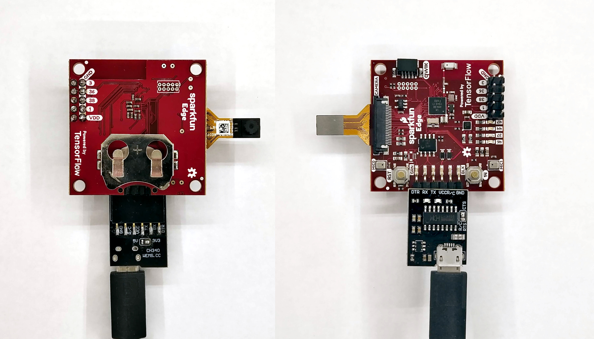
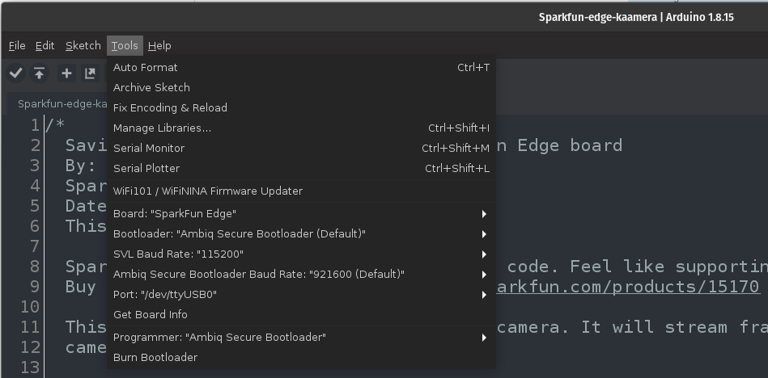
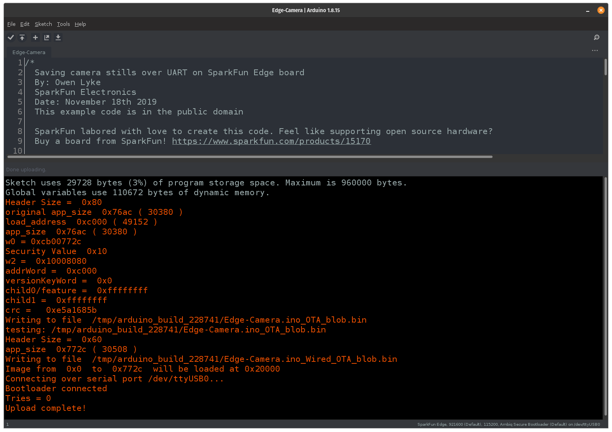
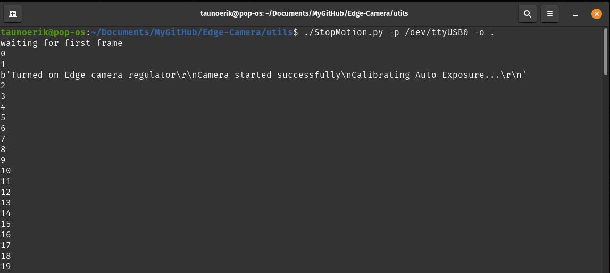
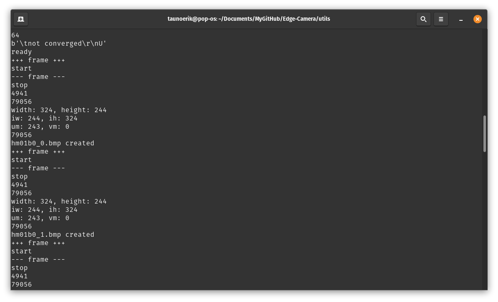
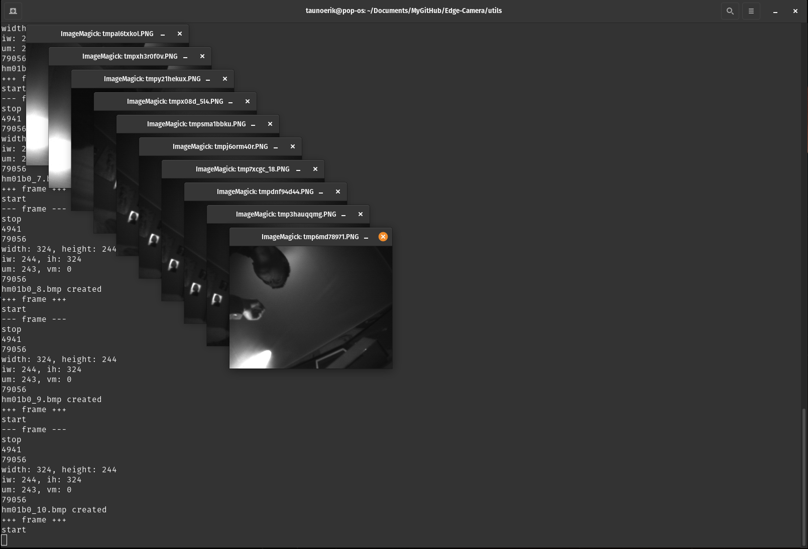

# Spurkfun Edge Camera

My Arduino settings and code to use Sparkfun Edge with the camera module.

## Arduino

### Hardware

* Sparkfun Edge (Input only 3.3V.)
* Himax CMOS Imaging Camera - HM01B0
* Wemos CH340G USB to serial (Make sure it output is 3.3V!)

### Boards

* Add Boards Manager URL: `https://raw.githubusercontent.com/sparkfun/Arduino_Boards/master/IDE_Board_Manager/package_sparkfun_index.json`
* Install `SparkFun Apollo3 Boards` package.

### Librarys

* Install `SparkFun Himax HM01B0 Cameras` library

### Settings

### Upload sketch

* Press and hold the Reset button
* Press and hold the 14 button
* Release the Reset button
* Hold the 14 button and hit Upload in the Arduino IDE

If it is successful you will see this message:

## Read images

Board default Serial Baudrate is 460800.

Example Python code is `utils/StopMotion.py`.

Run this to save images on same directory:

    ./StopMotion.py -p /dev/ttyUSB0 -o .

First you see something this. When I first tried this it was all I get. Only these numbers forever. Then on the next day I came back, hooked it up and miraculous it started to work.

Positive output

Example image (bmp):

## Links

* [SparkFun Edge Hookup Guide](https://learn.sparkfun.com/tutorials/sparkfun-edge-hookup-guide/all)
* [Programming the SparkFun Edge with Arduino](https://learn.sparkfun.com/tutorials/programming-the-sparkfun-edge-with-arduino/all)
* [SparkFun HM01B0 Camera Arduino Library](https://github.com/sparkfun/SparkFun_HM01B0_Camera_ArduinoLibrary)

 ___

Copyright Tauno Erik 2021 [taunoerik.art](https://taunoerik.art/)